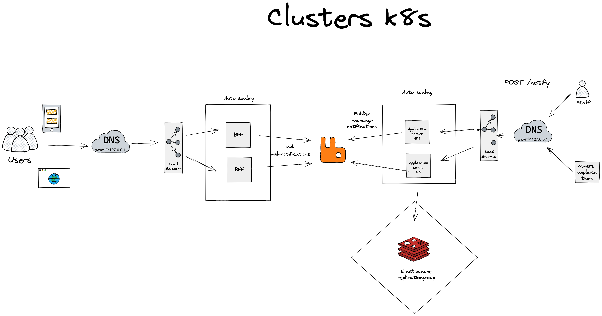

# Pubsub-notification

# How to Run

```
$ docker-compose up -d
```

- send instant notification
```
curl --location --request POST 'localhost:8080/api/notify' \
--header 'x-user-id: d3ad4b62-3423-420c-abdf-1b3f15eb1f8d' \
--header 'Content-Type: application/json' \
--data-raw '{
    "title": "celular",
    "message": "mensagem",
    "image": "cat.png",
    "type": "web"
}'
```

- send scheduler notification (format `yyyy-MM-dd HH:mm:ss`)
```
curl --location --request POST 'localhost:8080/api/notify' \
--header 'x-user-id: d3ad4b62-3423-420c-abdf-1b3f15eb1f8d' \
--header 'Content-Type: application/json' \
--data-raw '{
    "title": "celular",
    "message": "scheduler msg",
    "image": "cat.png",
    "type": "web",
    "scheduler_datetime": "2022-11-06 20:19:00"
}'
```

- set opt-out user
```
curl --location --request POST 'localhost:8080/api/user/opt-out' \
--header 'Content-Type: application/json' \
--data-raw '{
    "user_id": "33f0a01e-bafc-47cb-b5b8-f96d451086ed"
}'
```

- del opt-out user
```
curl --location --request DELETE 'localhost:8080/api/user/opt-out/33f0a01e-bafc-47cb-b5b8-f96d451086ed'
```

- simulate consumer web client
```
ws://localhost:1323/notifications/track/${userUUID}
```


# Observability
- logs `http://localhost:5601/app/logs/stream`
- metrics `http://localhost:8080/metrics`
- trace NTD

# Test coverage
```
make test-cov-html
```
# Arquitecture



# Monorepo

- api folder is the publish-notification-api
- notification-tracking-app folder is the bff
